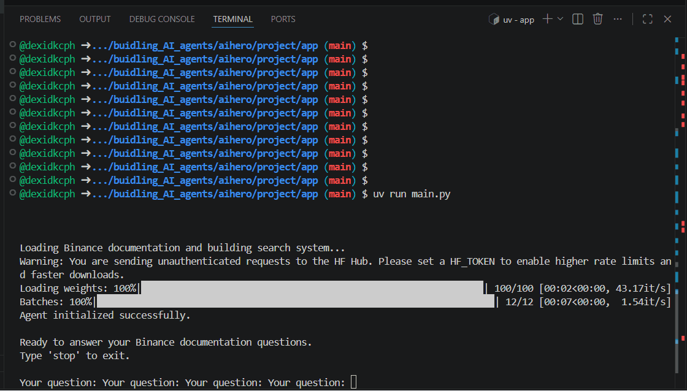
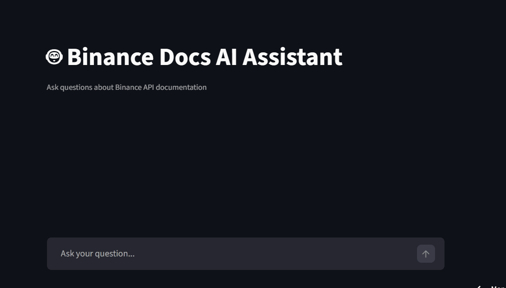

# Binance API AI Agent

An AI-powered agent that answers Binance API questions using retrieval, hybrid search, and tool-based reasoning.

This project demonstrates how to build a production-style AI agent that is grounded in documentation instead of guessing.

---

## Overview

Most AI assistants hallucinate when answering technical API questions.

This project solves that by combining:

- Document ingestion from Binance API docs
- Hybrid search (text + semantic)
- Tool-based agent reasoning
- Grounded responses with context

The agent always retrieves relevant documentation before answering.

Live app at Streamlit: https://binance-docs-agent.streamlit.app/

---

## Demo

### Main Demo (Agent in Action)

https://www.loom.com/share/YOUR_VIDEO_LINK

**Demo Question:**

I get a "timestamp for this request was 1000ms ahead of the server’s time" error when placing a signed order on Binance API — what causes it and how do I fix it?

---

### CLI Demo

---

### Streamlit App Demo

---

## Features

- Hybrid search (text + vector)
- SentenceTransformer embeddings
- Tool-based agent (Pydantic AI)
- Grounded answers (no hallucination)
- Streamlit UI for interaction
- Evaluation pipeline

---

## Project Architecture

binance_docs/        # raw documentation  
binance_embeddings/  # vector storage  
app/                 # Streamlit app  
agent/               # agent logic  
eval/                # evaluation scripts  

---

## Pipeline

### 1. Data Ingestion
- Load Binance API documentation (Markdown)
- Parse into structured format

### 2. Chunking
- Section-based chunking
- Preserves context for retrieval

### 3. Embeddings
- Model: multi-qa-distilbert-cos-v1
- Converts text into vectors for semantic search

### 4. Hybrid Search
Combines:
- Keyword search → exact matches
- Vector search → semantic similarity

### 5. Agent
- Built with Pydantic AI
- Uses search_docs() tool
- Always retrieves before answering

---

## Installation

git clone https://github.com/dexidkcph/buidling_AI_agents.git  
cd buidling_AI_agents 

Install dependencies:
uv sync  

Set environment variables:
OPENAI_API_KEY=your_key  

---

## Usage

Run Streamlit App:
streamlit run app/app.py  

Example Query:
What is recvWindow in Binance API?

---

## Evaluation

We tested:
- Retrieval accuracy
- Answer correctness
- Grounding quality

Results:

Version | Accuracy | Hallucination  
v1     | Medium  | High  
v2     | High    | Low  

---

## Challenges & Fixes

- Hallucination → fixed with tool usage  
- Retrieval quality → improved with hybrid search  
- Environment → fixed with .env  
- Performance → Streamlit caching  

---

## Tech Stack

- Python
- Streamlit
- SentenceTransformers
- Pydantic AI
- OpenAI API
- uv

---

## What I Learned

- Retrieval > prompting
- Hybrid search improves quality
- Agents need tools
- Evaluation is critical

---

## Future Improvements

- Add real-time Binance API testing
- Add reranking
- Add memory
- Deploy as API

---

## Author

Deheng Xie

---

## License

MIT
