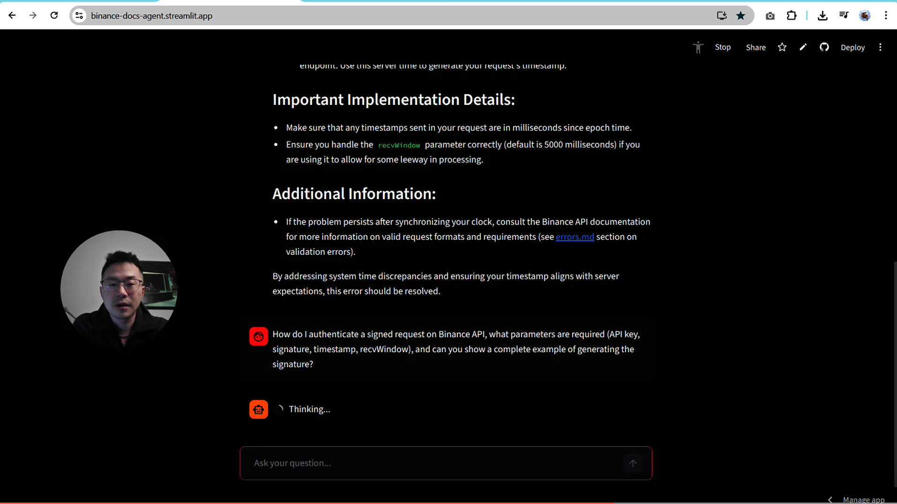

# Binance API AI Agent

An AI-powered agent that answers Binance API questions using retrieval, hybrid search, and tool-based reasoning.

This project demonstrates how to build a production-style AI agent that is grounded in documentation instead of guessing.

---

## Overview

Most AI assistants hallucinate when answering technical API questions.

This project solves that by combining:

- Document ingestion from Binance API docs
- Hybrid search (text + semantic)
- Tool-based agent reasoning
- Grounded responses with context

The agent always retrieves relevant documentation before answering.

Live app at Streamlit: https://binance-docs-agent.streamlit.app/

---

## Demo

### Main Demo (Agent in Action)

This demo shows the agent diagnosing a real Binance API error using retrieval and tool-based reasoning.

<a href="https://www.loom.com/share/796f6995b3a64ec5b1ea8c9a1a0ca688">
  
</a>

---

### Demo Questions

**1. Timestamp Error Debugging**

I get a "timestamp for this request was 1000ms ahead of the server’s time" error when placing a signed order on Binance API — what causes it and how do I fix it?

**2. Authentication & Signature**

How do I authenticate a signed request on Binance API, what parameters are required (API key, signature, timestamp, recvWindow), and can you show a complete example of generating the signature?

---

### CLI Demo

```bash
uv run main.py
```

This opens an interactive CLI environment. You can ask the conversational agent any question about Binance.

<p align="left">
  
</p>
Type `stop` to exit

---

### Streamlit App Demo

<p align="left">
  
</p>

---

## Features

- Hybrid search (text + vector)
- SentenceTransformer embeddings
- Tool-based agent (Pydantic AI)
- Grounded answers (no hallucination)
- Streamlit UI for interaction
- Evaluation pipeline

---

## Project Architecture

binance_docs/        # raw documentation  
binance_embeddings/  # vector storage  
app/                 # Streamlit app  
agent/               # agent logic  
eval/                # evaluation scripts  

---

## Pipeline

### 1. Data Ingestion
- Load Binance API documentation (Markdown)
- Parse into structured format

### 2. Chunking
- Section-based chunking
- Preserves context for retrieval

### 3. Embeddings
- Model: multi-qa-distilbert-cos-v1
- Converts text into vectors for semantic search

### 4. Hybrid Search
Combines:
- Keyword search → exact matches
- Vector search → semantic similarity

### 5. Agent
- Built with Pydantic AI
- Uses search_docs() tool
- Always retrieves before answering

---

## Installation

git clone https://github.com/dexidkcph/buidling_AI_agents.git  
cd buidling_AI_agents 

Install dependencies:
uv sync  

Set environment variables:
OPENAI_API_KEY=your_key  

---

## Usage

Run Streamlit App:
streamlit run app/app.py  

Example Query:
What is recvWindow in Binance API?

---

## Evaluations

Evaluation is a critical component of this project to ensure the agent produces grounded and reliable answers.

### Evaluation Criteria

We evaluate the agent across the following dimensions:

- `instructions_follow` – The agent follows the user's request
- `instructions_avoid` – The agent avoids restricted or irrelevant actions
- `answer_relevant` – The response directly answers the question
- `answer_clear` – The response is clear and understandable
- `answer_citations` – The answer is grounded in retrieved documentation
- `completeness` – The response covers all important aspects
- `tool_call_search` – The agent correctly uses the retrieval tool

---

### Evaluation Pipeline

The evaluation is performed in two stages:

1. **Synthetic Data Generation**
   - Questions are generated to simulate real user queries
   - Covers authentication, errors, parameters, and order placement
   - See: `eval/data-gen.ipynb`

2. **Agent Evaluation**
   - The agent answers each question
   - Responses are scored across all criteria
   - See: `eval/evaluations.ipynb`

---

### Results

| Metric               | Score (%) |
|---------------------|----------|
| instructions_follow | 100      |
| instructions_avoid  | 100      |
| answer_relevant     | 100      |
| answer_clear        | 100      |
| answer_citations    | 100      |
| completeness        | 70       |
| tool_call_search    | 100      |

---

### Key Insights

- The agent performs strongly on **relevance and correctness** (`100%`)
- Retrieval grounding is effective (`answer_citations = 100%`)
- Tool usage is reliable (`tool_call_search = 100%`)

However:

- `completeness` is lower (70%), indicating that:
  - Some answers miss edge cases or deeper explanations
  - The agent may retrieve correct context but not fully synthesize it

---

### Improvements

- Increase evaluation dataset size (currently limited to ~10 questions)
- Add more complex, multi-step queries (e.g. debugging API errors)
- Introduce adversarial questions to test robustness
- Improve answer synthesis to increase completeness

---

### Key Takeaway

Retrieval + tool-based agents significantly outperform prompt-only approaches in:

- Accuracy
- Reliability
- Grounding

However, evaluation reveals that **retrieval alone is not enough** — answer synthesis remains a key challenge.

## Challenges & Fixes

- Hallucination → fixed with tool usage  
- Retrieval quality → improved with hybrid search  
- Environment → fixed with .env  
- Performance → Streamlit caching  

---

## Tech Stack

- Python
- Streamlit
- SentenceTransformers
- Pydantic AI
- OpenAI API
- uv

---

## What I Learned

- Retrieval > prompting
- Hybrid search improves quality
- Agents need tools
- Evaluation is critical

---

## Future Improvements

- Add real-time Binance API testing
- Add reranking
- Add memory
- Deploy as API

---

## Author

Deheng Xie

---

## License

MIT
